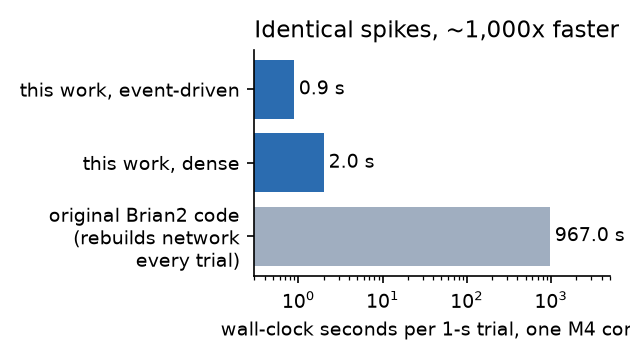
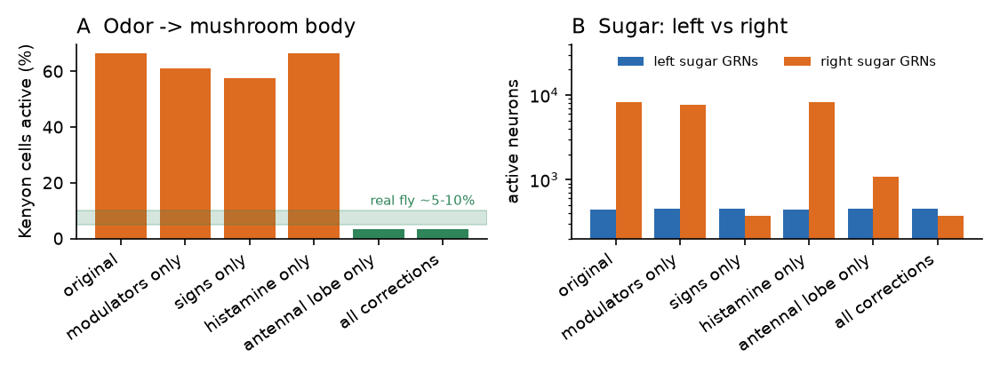
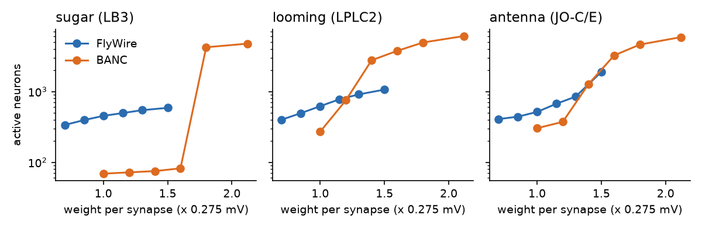
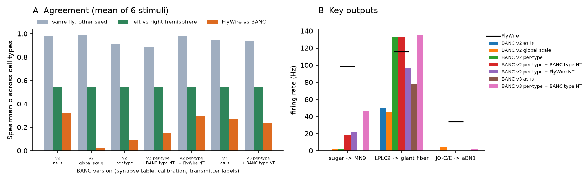

# cerebro: o sistema nervoso inteiro da mosca-da-fruta, melhorado

[](https://doi.org/10.5281/zenodo.23005090)

O cérebro completo de uma mosca (*Drosophila melanogaster*) copiado neurônio
por neurônio do conectoma FlyWire, simulado como rede de neurônios que
disparam (LIF), com correções biológicas, memória ensinada pela dopamina e a
medula real (conectoma BANC) acoplada. Roda num notebook (Apple M4, 16 GB).

## Resultados principais (rascunho de artigo em `artigo/preprint.md`)

1. **Motor exato ~1.000x mais rápido**: os mesmos disparos do modelo original,
   1 s de cérebro em 0,9 s num núcleo (o código original: 967 s por tentativa).
   
2. **Auditoria do modelo de Shiu et al.**: todas as previsões confirmadas em
   moscas reais que testamos continuam valendo com as correções. Mas, no
   modelo original, um cheiro ativa 66% das células de Kenyon (na mosca, ~5-10%),
   e o açúcar do lado **direito** ativa 8.323 neurônios contra 446 do
   esquerdo. A causa é **um único neurônio**: o il3LN6 esquerdo, inibitório
   (GABA), está como excitatório no arquivo do modelo. Corrigindo só ele, a
   resposta cai para 377 neurônios.
   
3. **Estabilidade**: o FlyWire aguenta de 0,7x a 1,5x no peso das sinapses; o
   cérebro BANC explode a partir de ~1,4x.
   
4. **Duas moscas**: mesmos experimentos no FlyWire e no BANC, tipo celular por
   tipo celular, em sete versões do BANC. Repetir a simulação dá ρ = 0,98; os
   dois lados do mesmo cérebro, ρ = 0,54; duas moscas, no máximo ρ = 0,32. As
   tabelas de sinapses do BANC têm menos sinapses por neurônio (2,1x menos na
   v2, 1,7x na v3; varia por região) e o BANC é menos inibido (as previsões de
   neurotransmissor discordam em 7% dos tipos). Calibrando por tipo, com sinais
   por tipo, voltam açúcar -> MN9 e ameaça -> Fibra Gigante; antena -> aBN1,
   não.
5. **Erro nos dados do BANC**: a coluna de consenso de neurotransmissor por
   tipo contradiz os próprios neurônios em 68 tipos (9.088 neurônios), por
   exemplo células de Kenyon "serotonina" e LPLC2 "glutamato"
   (`experimentos/17_nt_banc.py`).
   

## O que já era público

| peça | origem |
|---|---|
| Conectoma do cérebro: 138.639 neurônios, 15,1 milhões de conexões (v783) | FlyWire (Dorkenwald et al. 2024) |
| Anotações de cada neurônio (tipo, classe, neurotransmissor) | Schlegel et al. 2024 |
| Modelo LIF do cérebro inteiro (Brian2) | Shiu et al., Nature 2024 (`vendor/Drosophila_brain_model`, MIT) |
| Conectoma cérebro + medula de outra mosca: ~188 mil neurônios (v888) | BANC (Bates, Phelps, Kim, Yang et al. 2026) |

## O que melhoramos

**1. Motor de simulação passo a passo** (`cerebro.py`)
- Mesmas equações do modelo original, reescrito em numba, rodando em pedaços
  de tempo (o original só roda experimentos fechados).
- Validado contra o Brian2 no experimento do açúcar: correlação **0,999**
  entre as taxas de disparo; MN9 (neurônio motor da probóscide) a 77,7 Hz
  contra 78,8 Hz no original.
- Detalhe que fazia diferença: no Brian2, sinais que chegam a um neurônio no
  período refratário são descartados ("unless refractory").
- Dois modos, trocados sozinhos (`modo="auto"`) e com resultado idêntico
  disparo por disparo: denso (integra todos os neurônios) e por eventos (só
  os que saíram do repouso; mais rápido quando a atividade é esparsa).
  Validado em `12_motor_eventos.py`: 0 disparos diferentes.
- Velocidade, mesma tentativa do artigo (açúcar a 150 Hz, 1 s simulado, um
  núcleo do M4): modelo original em Brian2 **967 s** (montando a rede, como
  o código original faz a cada tentativa); o nosso **0,5 s** + 0,4 s para
  carregar. Com cheiros ou ameaças, onde 40-70% do cérebro se ativa: 1,6-2,1 s
  por segundo simulado.
- Extras: limiar e repouso por neurônio, depressão sináptica, estímulos,
  silenciamento e pesos editáveis em tempo real (para aprendizado).

**2. Correções biológicas nos dados** (`biologia.py`)
- Dopamina, serotonina e octopamina (~2 milhões de sinapses) estavam como
  excitação rápida. Agora 616 neurônios moduladores (por identidade) saem da
  transmissão rápida.
- ~3 mil neurônios GABA/glutamatérgicos estavam como excitatórios: sinal pelo
  neurotransmissor conhecido da literatura.
- A previsão automática de neurotransmissor diz que as 5.172 células de Kenyon
  são dopaminérgicas; são colinérgicas (usar a previsão cegamente desliga o
  corpo cogumelo inteiro).
- Lobo antenal: ~31 mil sinapses químicas excitatórias laterais (neurônio
  local colinérgico -> PN e PN -> PN) faziam qualquer cheiro acender ~90% dos
  neurônios de projeção de todos os glomérulos. Na mosca essa excitação
  lateral é sobretudo por junções elétricas fracas. Sem elas: 80-93% dos PNs
  do glomérulo certo ativos contra 1% dos outros, e as células de Kenyon
  passam de ~53% ativas (quase iguais para todos os cheiros) para ~4%.
- Histamina (fotorreceptores) passa a inibir, como na mosca (canais de cloreto).
- Cada correção pode ser ligada sozinha (`aplicar(..., moduladores=, sinais=,
  histamina=, lobo_real=)`), para auditar o efeito de cada uma.

**3. Memória: corpo cogumelo ensinado pela dopamina** (`memoria.py`)
- Código de cheiro esparso e específico saindo da fiação real: cada cheiro
  ativa 1,5-4% das células de Kenyon, com 0-1% de sobreposição entre cheiros
  (como na mosca real).
- Compartimentos tirados dos dados: cada neurônio de dopamina (PAM =
  recompensa, PPL1 = punição) conecta nos MBONs do seu compartimento
  (PAM01 -> MBON01 γ5, PPL101 -> MBON11 γ1pedc...).
- Regra de plasticidade (Hige et al. 2015): célula de Kenyon ativa + dopamina
  no compartimento -> a sinapse KC->MBON enfraquece.
- Condicionamento (`05_aprender.py`): cheiro + açúcar **+1,88** (atrai),
  cheiro + punição **-0,61** (repele), cheiros de controle ~0.

**4. Medula real acoplada** (`medula.py`)
- 28.085 neurônios da medula BANC e 872 mil conexões; os descendentes do
  BANC disparam na taxa dos equivalentes do FlyWire (879 tipos casados).
- Os 391 motoneurônios de perna vêm com perna e função anotadas. Os comandos
  de virar (DNa01/DNa02) ativam as pernas do mesmo lado.
- Sinapses elétricas bem estabelecidas, invisíveis no conectoma químico,
  acrescentadas da literatura (King & Wyman 1980; Allen et al. 2006):
  Fibra Gigante -> TTMn (salto) e -> PSI; PSI -> motoneurônios de voo DLM
  (1:1). Um disparo da Fibra Gigante -> salto + 5 motoneurônios de voo.
- As duas Fibras Gigantes do BANC são muito conectadas entre si (~620
  sinapses): sem cansaço sináptico, no modelo LIF elas se disparam para
  sempre. Com habituação na saída da Fibra Gigante o circuito responde uma
  vez e se apaga.

## Achados sobre os circuitos

- Açúcar -> MN9 (comer) e objeto se aproximando -> LPLC2 -> Fibra Gigante
  (fugir) saem da fiação sozinhos.
- Ameaça de um lado ativa os neurônios de virar do lado oposto (vira para longe).
- O cheiro de comida *inibe* o MN9: com cheiro presente é preciso mais açúcar.
- O lado do cheiro chega aos neurônios de virar (antena esquerda: 38,7 Hz nos
  DNa esquerdos; antena direita: 15,3 Hz), mas só os DNa esquerdos respondem.
- Açúcar não chega à dopamina de recompensa pelo conectoma (0 Hz); amargo
  chega fraco à de punição (~2 Hz).
- MBONs de "aproximar" ativam ~50-60 descendentes; os de "evitar" quase nenhum;
  mas depois do aprendizado a mudança nos descendentes fica em ±1 Hz.

## Como rodar

Dados públicos (~1 GB, não vão para o GitHub): `scripts/baixar_dados.sh`.

```bash
uv run python experimentos/01_validar_cerebro.py   # nosso motor x modelo original (Brian2)
uv run python experimentos/02_mapear_saidas.py     # que descendentes respondem a cada sentido
uv run python experimentos/04_calibrar.py          # açúcar -> MN9, com e sem cheiro
uv run python experimentos/05_aprender.py          # condicionamento olfativo pela dopamina
uv run python experimentos/10_medula.py            # descendentes -> motoneurônios pela medula BANC
uv run python experimentos/11_testes_circuitos.py  # lobo antenal, lado do cheiro, reforço, MBON -> descendentes
uv run python experimentos/12_motor_eventos.py     # modos denso x eventos x auto: velocidade e igualdade
uv run python experimentos/13_duas_moscas.py       # FlyWire x BANC, tipo por tipo, com controles
uv run python experimentos/14_auditoria.py         # o que cada correção muda no modelo original
uv run python experimentos/15_escala.py            # varredura do peso por sinapse nas duas moscas
uv run python experimentos/16_figuras.py           # figuras do artigo
uv run python experimentos/17_nt_banc.py           # checagem do consenso de neurotransmissor do BANC
uv run --with markdown python scripts/gerar_pdf.py # artigo/preprint.pdf
```

## Estrutura

| arquivo | o que faz |
|---|---|
| `src/mosca/cerebro.py` | motor LIF passo a passo (numba), validado contra o original |
| `src/mosca/neuronios.py` | catálogo de neurônios por tipo (anotações FlyWire) |
| `src/mosca/biologia.py` | correções biológicas (moduladores, sinais, lobo antenal) |
| `src/mosca/memoria.py` | corpo cogumelo: código de cheiro e aprendizado por dopamina |
| `src/mosca/medula.py` | medula BANC, acoplamento com o cérebro, sinapses elétricas |
| `src/mosca/banc.py` | cérebro da segunda mosca (BANC) com nomes FlyWire, calibração por tipo |
| `artigo/` | rascunho do preprint, mensagens às equipes, como publicar |
| `scripts/baixar_dados.sh` | baixa todos os dados públicos |
| `dados/` | conectoma (cache), anotações FlyWire, BANC (`dados/banc/`) |
| `vendor/Drosophila_brain_model` | modelo original de Shiu et al. |
| `resultados/` | vídeos e gráficos das simulações com corpo |
| `arquivo/corpo/` | código do corpo virtual (arquivado, fora do projeto principal) |

## Corpo virtual (arquivado)

O cérebro chegou a controlar um corpo físico (NeuroMechFly v2 no MuJoCo):
comer, aprender cheiros (6 de 6 moscas treinadas foram ao cheiro bom), ver
pelos olhos compostos, fugir saltando e voando, dormir à noite e sobreviver
dias inteiros. O código e a documentação completa estão em `arquivo/corpo/`
e os vídeos em `resultados/`.

## Limites

- Modelo de neurônio simplificado: mesmos parâmetros para todos, sem
  neuromodulação lenta, sem junções elétricas (exceto as 3 acrescentadas).
- A medula é de outra mosca. Entre duas moscas, as previsões por tipo celular
  concordam pouco (ρ ≤ 0,32): conclusões finas devem ser checadas nos dois
  lados do cérebro e nos dois conectomas.
- Sem revisão por pares; comportamentos não comparados quantitativamente com
  moscas reais.

## Relatos enviados às equipes

- Modelo de Shiu et al.: [philshiu/Drosophila_brain_model#11](https://github.com/philshiu/Drosophila_brain_model/issues/11) (il3LN6 e sinais)
- Anotações FlyWire: [flyconnectome/flywire_annotations#7](https://github.com/flyconnectome/flywire_annotations/issues/7) (LB1e, LB3)
- BANC: [jasper-tms/the-BANC-fly-connectome#8](https://github.com/jasper-tms/the-BANC-fly-connectome/issues/8) (consenso de neurotransmissor)

## Autor

Allan Matheus Silva Santos · Instagram [@allanmt_dev](https://instagram.com/allanmt_dev)

## Créditos

Conectoma FlyWire (Dorkenwald et al. 2024, Schlegel et al. 2024), modelo do
cérebro (Shiu et al. 2024, MIT), conectoma BANC (Bates, Phelps, Kim, Yang et
al. 2026). Corpo arquivado: NeuroMechFly v2 / FlyGym (Wang-Chen et al. 2024,
Apache 2.0), MuJoCo.
